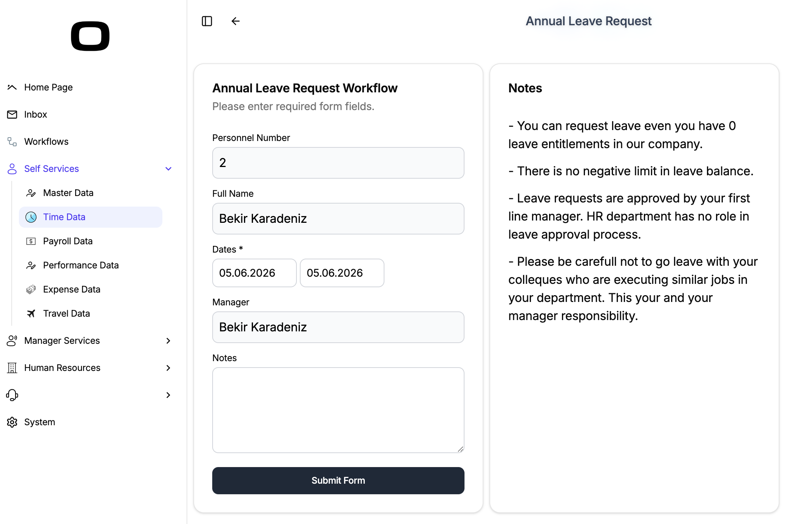
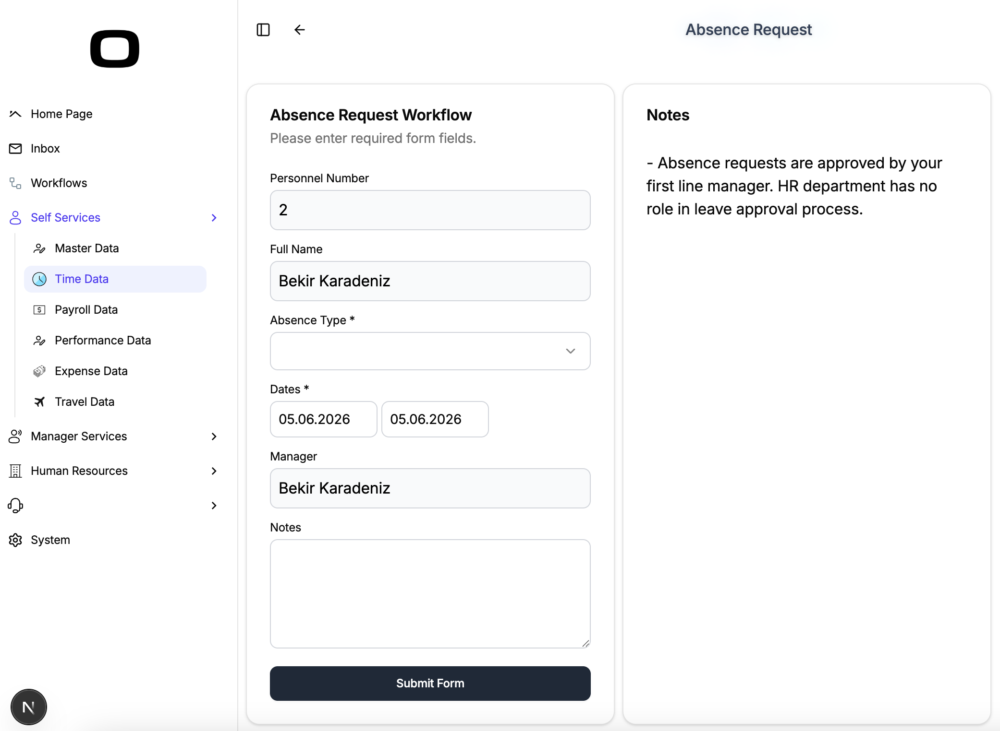
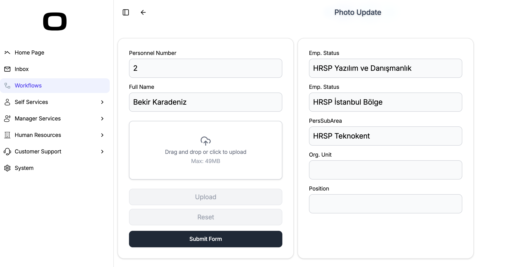
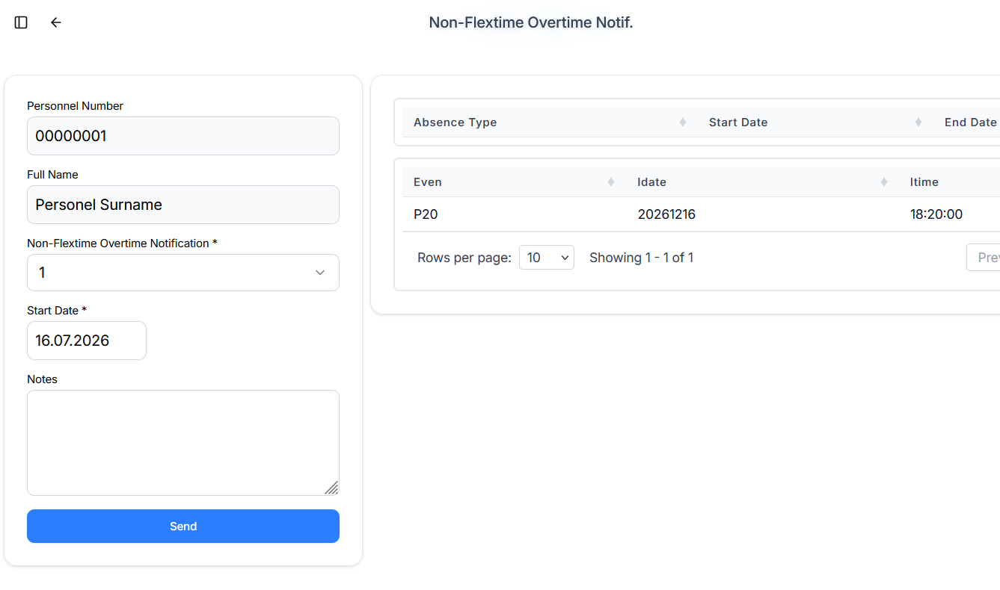

# Workflows
Scheme Based Business Workflows with UI Designs for Web and Mobile

OrchestraHCM helps teams digitize HR processes with speed, clarity, and confidence.
With flexible workflow design and user-friendly screens, it turns complex approvals into smooth daily operations.
From web to mobile, OrchestraHCM delivers a modern employee experience while giving managers full control.

- [Annual Leave Request](#annual-leave-request-only-via-manager-approval) - A single-step process where annual leave requests are submitted for manager approval.
- [Absence Request](#absence-request-only-via-manager-approval) - A single-step manager approval process for different types of absence requests.
- [Photo Update Workflow](#photo-update-workflow) - A workflow for employee photo update requests.
- [Non-Flextime Overtime Notification](#non-flextime-overtime-notification) - A single-step manager approval process for overtime worked outside the employee's flexible working hours.
## Annual Leave Request (only via Manager Approval)

### Business Requirement
Company need to have a digital solution to enable workforce to request annual leave from their managers. 
### Solution Scenerio
Employee requests annual leave from his/her manager online. Manager approves or rejects from taskbox. Manager assignment is read from infotype 0500. This is one step workflow process.
### Download Files and Upload to OrchestraHCM
Download [Scheme](/WF_LREQUEST.json) and  [Screen](/orc.ess.tm.leavereq.json), and make your changes according to your business requirements.
### Notes
- Please customize absence types in your time management module, annual leave absence type in scheme is 1000, if different please modify in INFTY function.
### Versions
- June 4, 2026 - Initial Commit

## Absence Request (only via Manager Approval)

### Business Requirement
Company need to have a digital solution to enable workforce to request different types of absences from their managers. 
### Solution Scenerio
Employee requests absence request from his/her manager online. Manager approves or rejects from taskbox. Manager assignment is read from infotype 0500. This is one step workflow process.
### Download Files and Upload to OrchestraHCM
Download [Scheme](/WF_AREQUEST.json) and  [Screen](/orc.ess.tm.absrequest.json), and make your changes according to your business requirements.
### Notes
- Please customize absence types in your time management module.
- You can exclude any of absences in SETOP function options by using EXFILTER.
- There is no file attachment feature in this workflow, for absence types that needs document proof, you can add file component and modify your scheme.
### Versions
- June 4, 2026 - Initial Commit

## Photo Update Workflow

### Business Requirement
Company need to have a digital solution to enable workforce to update profile photos through a controlled approval process.
### Solution Scenerio
Employee submits a profile photo update request online. HR expoert reviews and approves or rejects from taskbox.
### Download Files and Upload to OrchestraHCM
Download [Scheme](/WF_FLEX.json) and [Screen](/orc.ess.tm.requestaddtime.json), and make your changes according to your business requirements.
### Notes
- You can define photo validation rules (file type, size, and image dimensions) in your screen and scheme logic.
- When employee 's photo approved, user should refresh the page to see her/his photo in app header.
- If your organization needs additional approvals, you can extend the scheme with extra approval steps.
### Versions
- June 4, 2026 - Initial Commit

## Non-Flextime Overtime Notification (only via Manager Approval)

### Business Requirement
Company need to have a digital solution to enable employees to notify overtime worked outside their flexible working hours through a controlled approval process.
### Solution Scenerio
Employee submits an overtime notification for hours worked outside flexible working hours online. Manager reviews and approves or rejects the request from taskbox.
### Download Files and Upload to OrchestraHCM
Download [Scheme](/WF_LREQUEST.json) and  [Screen](/orc.ess.tm.leavereq.json), and make your changes according to your business requirements.
### Notes
- You can define overtime hour/hours in your screen and scheme logic.
- When the employee's overtime notification is approved, it is automatically reflected in the relevant reporting/payroll processes.
- If your organization needs additional approvals, you can extend the scheme with extra approval steps.
### Versions
- July 16, 2026 - Initial Commit
